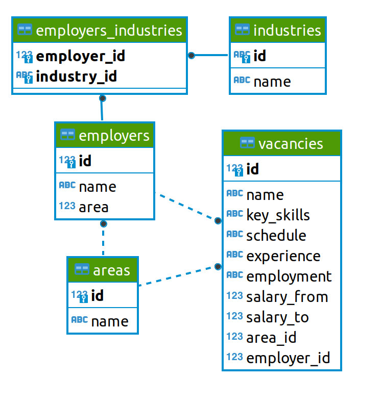
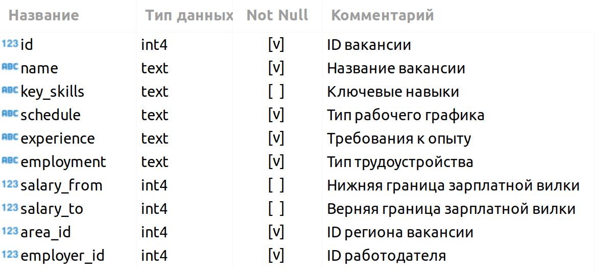
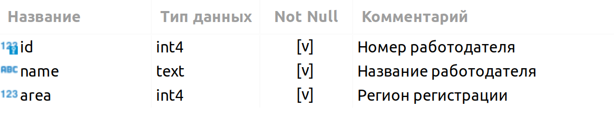
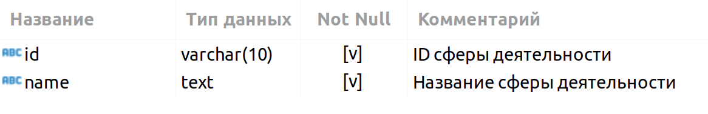
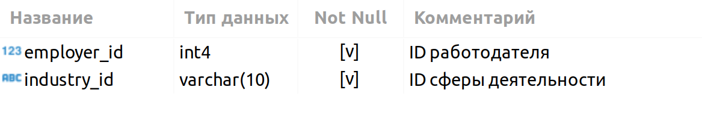

# Проект 2. Анализ базы данных вакансий c Head Hunter

## Оглавление  
1. <a href ="#section1">Описание проекта</a>  
2. <a href ="#section2">Какой кейс решаем?</a> 
3. <a href ="#section3">Краткая информация о данных</a> 
4. <a href ="#section4">Этапы работы над проектом</a> 
5. <a href ="#section5">Результат</a> 

### Описание проекта    
Зачётный проект под названием **"PROJECT-2. Анализ вакансий из HeadHunter"**. Подгрузка данных.  
Учебная платформа SkillFactory, Профессия Data Science.  

:arrow_up: <a href ="#section0">к оглавлению</a> 
***

### Какой кейс решаем?    
Представьте, что я устроился на работу в кадровое агентство, которое подбирает вакансии для *IT*-специалистов. Мой первый проект — создание модели машинного обучения, которая будет рекомендовать вакансии клиентам агентства, претендующим на позицию *Data Scientist*. Сначала вам необходимо понять, что из себя представляют данные и насколько они соответствуют целям проекта. В литературе эта часть работы над ML-проектом называется *Data Understanding*, или анализ данных.

**Условия соревнования:**  
- получение необходимых данных только посредством SQL (в нашем случае postgre)
- Notebooк необходимо оформить на основе предоставленного [шаблона](https://lms-cdn.skillfactory.ru/assets/courseware/v1/a39c1eedaae738f78d85c950f78223fa/asset-v1:SkillFactory+DSPR-2.0+14JULY2021+type@asset+block/Project_2_%D0%9D%D0%BE%D1%83%D1%82%D0%B1%D1%83%D0%BA_%D1%88%D0%B0%D0%B1%D0%BB%D0%BE%D0%BD.ipynb) и требований.
- Отправить свой код ментору для проверки.

**Требования к оформлению Notebooк**     

* Решение оформляется только в *Jupyter Notebook*.
* Решение оформляется в соответствии с ноутбуком-шаблоном.
* Каждое задание выполняется в отдельной ячейке, выделенной под задание (в шаблоне они помечены как **ваш код здесь**). Не следует создавать много ячеек для решения задачи — это провоцирует неудобства при проверке.
* Текст *SQL*-запросов и код на *Python* должны быть читаемыми. Не забывайте про отступы в *SQL*-коде.
* Выводы по каждому этапу оформляются в формате Markdown в отдельной ячейке (в шаблоне они помечены как **ваши выводы здесь**).
* Выводы можно дополнительно проиллюстрировать с помощью графиков. Они оформляются в соответствии с теми правилами, которые мы приводили в модуле по визуализации данных.
* Не забудьте удалить ячейку с данными соединения перед фиксацией работы в GitHub.

**Что практикуем**     
работу с данными, подгрузку данных из БД

### Краткая информация о данных
Схема данных
  
Таблица VACANCIES  
 
Таблица AREAS     
  
Таблица EMPLOYERS  

Таблица INDUSTRIES    
  
Таблица EMPOYERS_INDUSTRIES  

  
:arrow_up: <a href ="#section0">к оглавлению</a> 

### Этапы работы над проектом  

1. знакомство с данными;
2. предварительный анализ данных;
3. детальный анализ вакансий;
4. анализ работодателей;
5. предметный анализ;
6. дополнительный анализ;
7. оформление проекта на GitHub

:arrow_up: <a href ="#section0">к оглавлению</a> 

### Результаты:  
* поставленные задачи выполнениы с соблюдением поставленных условий
* выводы представлены в комментариях Notebooк после каждого раздела

:arrow_up: <a href ="#section0">к оглавлению</a> 
